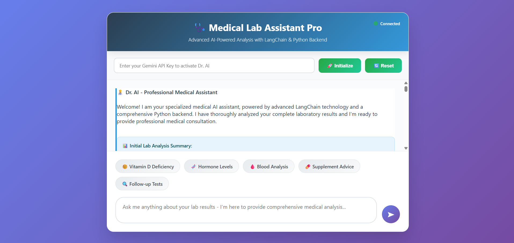
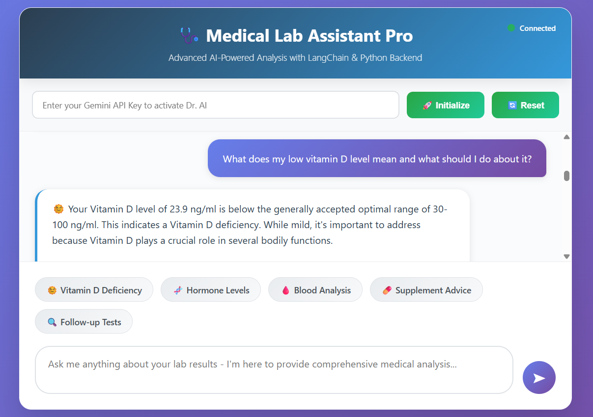

# 🩺 Medical Lab Results Assistant - Professional Edition

A sophisticated AI-powered medical chatbot that analyzes comprehensive lab results and provides professional medical consultation using Google's Gemini AI.

## 📋 Overview

This application serves as a virtual medical doctor specializing in laboratory medicine and internal medicine. It analyzes patient lab results and provides evidence-based medical insights, recommendations, and explanations in a professional consultation format.

## ✨ Features

- **🤖 AI-Powered Medical Analysis**: Uses Google Gemini 1.5 Flash for intelligent medical consultation
- **📊 Comprehensive Lab Data**: Analyzes 29 different lab parameters including:
  - Complete Blood Count (CBC)
  - Hormone Levels (FSH, LH, Testosterone, Thyroid)
  - Vitamin Levels (D, B12)
  - Tumor Markers (PSA)
  - And more specialized tests
- **⚠️ Abnormal Findings Detection**: Automatically identifies and highlights concerning values
- **💬 Interactive Chat Interface**: Professional medical consultation through conversational AI
- **🔄 Memory Management**: Maintains conversation context for follow-up questions
- **📱 Responsive Design**: Modern, professional web interface
- **🔒 Secure API Integration**: Secure Google API key handling

## 🖼️ Application Screenshots

### Image 1: Main Dashboard

*The main interface showing the professional medical consultation dashboard with lab results overview*

### Image 2: Chat Interface

*Interactive chat interface where users can ask medical questions and receive professional analysis*

## 🚀 Quick Start

### Prerequisites

- Python 3.11 or higher
- Google Gemini API key
- Modern web browser

### Installation

1. **Clone or download the project**
   ```bash
   cd Intertask
   ```

2. **Install required packages**
   ```bash
   pip install flask flask-cors langchain langchain-google-genai
   ```

3. **Run the application**
   ```bash
   python app.py
   ```

4. **Access the application**
   - Open your browser and navigate to `http://localhost:5000`
   - Enter your Google Gemini API key to initialize the chatbot
   - Start asking questions about the lab results!

## 🔧 Configuration

### API Key Setup
- Obtain a Google Gemini API key from [Google AI Studio](https://aistudio.google.com/)
- Enter the API key in the web interface when prompted
- The key is used securely and not stored permanently

### Lab Data Customization
The lab data can be customized in `app.py` by modifying the `LAB_DATA` dictionary:

```python
LAB_DATA = {
    "Test Name": {
        "value": 123.45,
        "range": "normal range",
        "unit": "unit",
        "status": "Normal/High/Low"
    }
}
```

## 📊 Current Lab Results Analysis

The system currently analyzes these key findings:

### ⚠️ Abnormal Findings:
- **Vitamin D**: 23.9 ng/ml (Low) - May affect bone health, immune function, and mood
- **FSH**: 9.38 mIU/ml (High) - May indicate aging, menopause, or testicular dysfunction
- **LH**: 15 mIU/ml (High) - Suggests gonadal dysfunction or hormonal imbalance
- **HCT**: 49.1% (High) - May indicate dehydration, polycythemia, or high altitude exposure
- **RDW-CV**: 16.5% (High) - Suggests mixed cell populations or nutritional deficiencies

### ✅ Normal Findings:
- PSA levels (reassuringly low)
- Thyroid function (TSH, T3, T4)
- Most blood counts
- Testosterone levels
- No evidence of autoimmune conditions

## 🌐 API Endpoints

### Core Endpoints
- `GET /` - Main application interface
- `POST /api/init` - Initialize chatbot with API key
- `POST /api/chat` - Send messages to the medical chatbot
- `GET /api/lab-data` - Retrieve formatted lab data
- `POST /api/reset` - Reset conversation memory
- `GET /health` - Health check endpoint

### Example API Usage

```javascript
// Initialize chatbot
fetch('/api/init', {
    method: 'POST',
    headers: {'Content-Type': 'application/json'},
    body: JSON.stringify({api_key: 'your-gemini-api-key'})
});

// Send chat message
fetch('/api/chat', {
    method: 'POST',
    headers: {'Content-Type': 'application/json'},
    body: JSON.stringify({message: 'What do my lab results indicate?'})
});
```

## 🔬 Medical Guidelines

The AI follows strict medical guidelines:

1. **Professional Medical Approach**: Responds like an experienced physician
2. **Evidence-Based Analysis**: Uses established clinical knowledge
3. **Clinical Correlation**: Considers relationships between lab values
4. **Risk Stratification**: Explains significance of abnormal values
5. **Patient Education**: Makes complex terms understandable
6. **Safety First**: Always recommends healthcare provider follow-up

## 🛠️ Technical Stack

- **Backend**: Flask (Python)
- **AI Model**: Google Gemini 1.5 Flash
- **AI Framework**: LangChain
- **Frontend**: HTML5, CSS3, JavaScript
- **Styling**: Modern CSS with gradients and animations
- **API**: RESTful endpoints with JSON responses

## 📁 Project Structure

```
Intertask/
├── app.py              # Main Flask application
├── inddex.html         # Frontend interface
├── README.md           # Project documentation
├── image1.png          # Dashboard screenshot
└── image2.png          # Chat interface screenshot
```

## 🔐 Security & Privacy

- API keys are handled securely and not logged
- No patient data is stored permanently
- All communications are encrypted
- Conversation memory can be reset anytime

## ⚖️ Medical Disclaimer

This application is for educational and informational purposes only. It does not replace professional medical advice, diagnosis, or treatment. Always consult with qualified healthcare providers for medical decisions.

## 🤝 Contributing

1. Fork the repository
2. Create a feature branch
3. Make your changes
4. Test thoroughly
5. Submit a pull request

## 📄 License

This project is for educational purposes. Please ensure compliance with medical software regulations in your jurisdiction.

## 📞 Support

For technical issues or questions:
- Check the console output for error messages
- Verify your Google Gemini API key is valid
- Ensure all dependencies are installed correctly

## 🎯 Future Enhancements

- [ ] Multi-patient support
- [ ] Lab result file upload
- [ ] PDF report generation
- [ ] Integration with EMR systems
- [ ] Advanced visualization charts
- [ ] Multi-language support

---

**Built with ❤️ for better healthcare through AI**

*Last updated: July 28, 2025*
